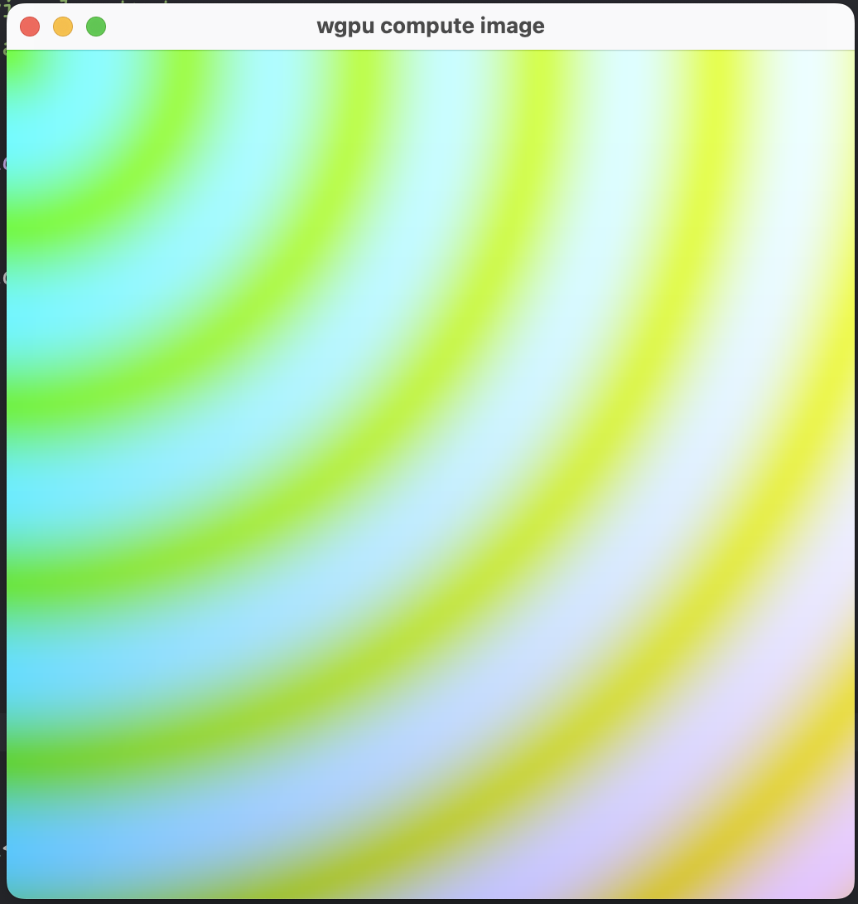

# wgpu compute image

A minimal example that:

- Opens a window with winit
- Uses a wgpu compute shader to write into a storage texture every frame
- Renders that texture to the screen with a fullscreen triangle



## Run

```bash
cargo run
```

If you are on Linux and see adaptor/surface issues, ensure you have Vulkan drivers installed, or set `WGPU_BACKEND=gl` to try the OpenGL backend.

## Notes

- The compute shader writes to an `rgba8unorm` storage texture.
- The render pass samples that texture and draws it to the swapchain surface.
- On resize, the storage texture and bind groups are recreated to match the new size.
